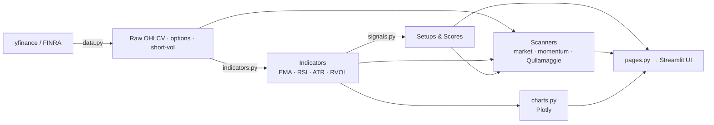

# 📈 Market Overview Dashboard

[](https://github.com/bugra123uysal/-Market_Overview_Dashboard/actions/workflows/ci.yml)
[](LICENSE)


**English** | [Türkçe](#-türkçe)

A one-page market briefing dashboard for momentum swing traders. Instead of jumping between a dozen browser tabs every morning — indices here, VIX there, sectors somewhere else — this app pulls everything into a single, color-coded view.

**🔗 Live demo:** https://genelbakis-j5hx65nam7p9cmv5sdx45f.streamlit.app/

> ⚠️ Educational tool only. No real orders are sent, and nothing here is investment advice.

## 💡 The Problem

Before opening any position, a trader needs context: How are the indices? Is VIX rising? Which sectors is money rotating into? How did Asia and Europe close? Checking all of this across separate tabs is slow and error-prone. This dashboard answers all of it in one glance.

## 🛠️ Features

**Bilingual UI (TR / EN)**
Switch the interface language between Turkish and English from the sidebar — the whole dashboard re-renders instantly.

**Daily Macro Summary**
Live values and daily change for S&P 500, Nasdaq, Dow, Russell 2000, VIX, 10-year yield, DXY, Gold, Oil, and Bitcoin — with a **Risk-On / Risk-Off banner** (green when indices are up and VIX is down; red otherwise).

**Sector Rotation Grid**
All 11 SPDR sectors (XLK, XLF, XLE, XLV, XLY, XLP, XLI, XLB, XLU, XLRE, XLC) ranked by weekly performance in a color-coded grid — see where money is flowing in and out at a glance.

**Global Markets**
16 indices across three regions: Americas (S&P, Nasdaq, Russell, Bovespa), Europe (FTSE, DAX, CAC, Euro Stoxx, BIST 100), Asia-Pacific (Nikkei, KOSPI, Hang Seng, Shanghai, Nifty, ASX).

**Market Regime Indicator**
Is the S&P 500 above or below its 200-day moving average? Green banner = bull regime, red = bear, yellow = transition.

**VIX Trend Chart**
5-day VIX closing line chart with fear zones: below 20 = calm, 20–30 = elevated, above 30 = panic.

**Market Leaders**
NVDA, META, TSLA, AMZN, AAPL, MSFT — the market's barometer stocks.

**Momentum & Setup Scanners**
- **Gap-Up Scanner** — finds stocks opening ≥3% above prior close (Episodic Pivot candidates)
- **Volume Anomaly Scanner** — flags stocks trading at 3x+ their 20-day average volume (tracking institutional footprints)
- **Qullamaggie-style Momentum Scan** — filters a broad universe by 1-year performance, relative strength, and ADR%
- **Minervini Trend Template** check per stock

**Trade Plan Builder**
Generates entry, stop, and R-multiple targets (1.5R / 3R) for a selected setup, rendered directly on the chart.

**Technical Toolkit**
EMA, RSI, MFI, OBV, ATR (Wilder), UT Bot signals, relative volume, ADR%, momentum score, stealth accumulation detection, downtrend line detection, and chart formation detection.

**Daily Commentary**
A plain-language summary generated from the collected data: How is the market? Is there risk? Which sectors deserve attention?

## 🧰 Tech Stack

| Layer | Technology |
|---|---|
| UI | Streamlit |
| Data | yfinance (Yahoo Finance) — no paid data subscription required |
| Analysis | pandas, numpy |
| Charts | Plotly |

## 🚀 Run Locally

```bash
# The repo name starts with a dash, so clone into a plain folder name:
git clone https://github.com/bugra123uysal/-Market_Overview_Dashboard.git market-overview-dashboard
cd market-overview-dashboard
pip install -r requirements.txt
streamlit run trading_app.py
```

`trading_app.py` is a thin entry point; the application lives in the
`market_overview/` package.

## 🗂️ Project Structure

```text
market_overview/
├── app.py            # entry: set_page_config, CSS, page routing
├── config.py         # symbol universes, macro assets, colors, constants
├── security.py       # sanitize_tickers — user-input validation
├── indicators.py     # EMA, RSI, MFI, OBV, ATR, RVOL, ADR%, trend template
├── signals.py        # setup detection, scoring, whale/flow signals
├── data.py           # yfinance/FINRA fetch, options flow, retry decorator
├── scanners.py       # market / momentum / Qullamaggie scanners
├── backtest.py       # backtest + trade-plan builder
├── charts.py         # Plotly chart builders
├── pages.py          # Streamlit page/section renderers
└── logging_conf.py   # central logger
trading_app.py        # thin Streamlit entry point (Streamlit Cloud target)
tests/                # network-free pytest suite
.github/workflows/    # CI (ruff + import sanity + pytest)
```

## 🔄 Data Flow



## ⚠️ Disclaimer

This application is for educational and informational purposes only. It is not investment advice and does not execute real trades. All investment decisions are your own responsibility.

## 📄 License

MIT

---

# 🇹🇷 Türkçe

Momentum swing trader'lar için tek sayfalık piyasa brifing panosu. Her sabah bir düzine sekme arasında gezinmek yerine — endeksler bir yerde, VIX başka yerde, sektörler başka yerde — bu uygulama her şeyi tek, renk kodlu bir ekranda toplar.

**🔗 Canlı demo:** https://genelbakis-j5hx65nam7p9cmv5sdx45f.streamlit.app/

> ⚠️ Yalnızca eğitim amaçlıdır. Gerçek emir göndermez, yatırım tavsiyesi değildir.

## 💡 Problem

Pozisyon açmadan önce trader'ın bağlama ihtiyacı vardır: Endeksler nasıl? VIX yükseliyor mu? Para hangi sektöre dönüyor? Asya ve Avrupa nasıl kapandı? Bunları ayrı sekmelerde kontrol etmek yavaş ve hataya açıktır. Bu pano hepsini tek bakışta cevaplar.

## 🛠️ Özellikler

**Çift Dilli Arayüz (TR / EN)**
Arayüz dilini kenar çubuğundan Türkçe ↔ İngilizce değiştir — tüm pano anında yeniden render edilir.

**Günlük Makro Özet**
S&P 500, Nasdaq, Dow, Russell 2000, VIX, 10 yıllık faiz, DXY, Altın, Petrol ve Bitcoin'in anlık değeri ve günlük değişimi — yanında **Risk-On / Risk-Off banner'ı** (endeksler yukarı + VIX aşağı ise yeşil; tersi kırmızı).

**Sektör Rotasyonu**
11 SPDR sektörünün tamamı (XLK, XLF, XLE, XLV, XLY, XLP, XLI, XLB, XLU, XLRE, XLC) haftalık performansa göre sıralanmış renk kodlu grid — paranın nereye girip nereden çıktığı tek bakışta.

**Dünya Borsaları**
Üç bölgede 16 endeks: Amerika (S&P, Nasdaq, Russell, Bovespa), Avrupa (FTSE, DAX, CAC, Euro Stoxx, BIST 100), Asya-Pasifik (Nikkei, KOSPI, Hang Seng, Shanghai, Nifty, ASX).

**Piyasa Rejimi Göstergesi**
S&P 500, 200 günlük hareketli ortalamasının üstünde mi altında mı? Yeşil = boğa rejimi, kırmızı = ayı, sarı = geçiş.

**VIX Trend Grafiği**
Son 5 günün VIX kapanışları, korku bölgeleriyle: 20 altı = sakin, 20–30 = yükselmiş, 30 üstü = panik.

**Öncü Hisseler**
NVDA, META, TSLA, AMZN, AAPL, MSFT — piyasanın barometre hisseleri.

**Momentum ve Setup Tarayıcıları**
- **Gap-Up Tarayıcı** — önceki kapanışın %3+ üstünde açılan hisseler (Episodik Pivot adayları)
- **Hacim Anomalisi Tarayıcı** — 20 günlük ortalama hacminin 3 katı üzerinde işlem görenler (kurumsal para izini sürmek için)
- **Qullamaggie tarzı momentum taraması** — geniş evreni 1 yıllık performans, göreli güç (RS) ve ADR%'ye göre filtreler
- Hisse başına **Minervini Trend Template** kontrolü

**Trade Plan Oluşturucu**
Seçilen setup için giriş, stop ve R-multiple hedefleri (1.5R / 3R) üretir, doğrudan grafik üzerinde gösterir.

**Teknik Araç Seti**
EMA, RSI, MFI, OBV, ATR (Wilder), UT Bot sinyalleri, göreli hacim, ADR%, momentum skoru, sessiz birikim (stealth accumulation) tespiti, düşen trend çizgisi tespiti ve formasyon tespiti.

**Günün Yorumu**
Toplanan verilere dayalı düz yazı özet: Piyasa nasıl? Risk var mı? Hangi sektöre dikkat etmeli?

## 🚀 Yerelde Çalıştırma

```bash
# Repo adı tire ile başlar; düz bir klasör adına klonlayın:
git clone https://github.com/bugra123uysal/-Market_Overview_Dashboard.git market-overview-dashboard
cd market-overview-dashboard
pip install -r requirements.txt
streamlit run trading_app.py
```

`trading_app.py` ince bir giriş noktasıdır; uygulama `market_overview/`
paketinde yaşar. Proje yapısı ve veri akışı diyagramı için üstteki
[Project Structure](#️-project-structure) ve [Data Flow](#-data-flow)
bölümlerine bakın.

## ⚠️ Uyarı

Bu uygulama eğitim ve bilgilendirme amaçlıdır. Yatırım tavsiyesi değildir, gerçek emir göndermez. Tüm yatırım kararları size aittir.

## 📄 Lisans

MIT

---

## 👤 Developer / Geliştirici

**Mesut Buğra Uysal**
[GitHub](https://github.com/bugra123uysal) · [LinkedIn](https://www.linkedin.com/in/mesut-bu%C4%9Fra-uysal-16a1bb288/)
